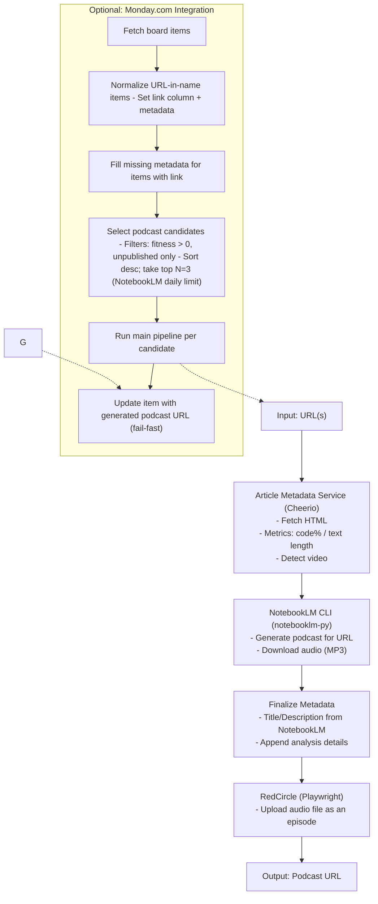

# Automated NotebookLM (Concept Prototype)

This repository demonstrates an experimental pipeline that automates Google NotebookLM to generate podcast audio from URLs, converts the audio to MP3, and optionally uploads an episode to RedCircle. It also includes an optional Monday.com integration to pick daily candidates.

Important: This project is a concept prototype intended for educational purposes. It automates interactions that may violate Google NotebookLM and RedCircle Terms of Use. Running this project is solely at your own risk and responsibility and should only be done after reviewing the relevant Terms of Use.

## Features

- Generate NotebookLM studio podcast for a given URL using `notebooklm-py` CLI
- Download MP3 audio directly from NotebookLM
- Upload MP3 to RedCircle as an episode (optional)
- Monday.com integration to prepare items and select top candidates (optional)

## Installation

1. Clone the repository:

```bash
git clone https://github.com/omril321/automated-notebooklm.git
cd automated-notebooklm
```

2. Install dependencies:

```bash
yarn install
```

3. Set up the NotebookLM CLI:

```bash
# Install notebooklm-py CLI (requires Python 3.10+ and uv)
./scripts/setup-nlm.sh

# Authenticate with Google (opens browser for OAuth)
./scripts/nlm login

# Verify setup
./scripts/nlm list
```

4. Create a `.env` file for optional integrations:

```bash
cp .env.example .env
```

5. Edit the `.env` file (all settings are optional):

```
# Optional: RedCircle upload
RED_CIRCLE_USER=
RED_CIRCLE_PASSWORD=
PUBLISHED_PODCAST_NAME=

# Optional: Monday.com integration
MONDAY_API_TOKEN=
MONDAY_BOARD_URL=
MONDAY_EXCLUDED_GROUP_IDS=
```

## Contributing & Discussions

This project is shared as a concept/prototype, so I’m not accepting code contributions right now. That said, I’d love to hear your thoughts and learn from your use cases. If you want to chat, brainstorm, or ask questions:

- Open a GitHub Issue on this repo, or
- Reach out via direct message

Thanks for taking the time to check it out!

## Usage

### Generate podcasts (Monday.com mode by default)

```bash
yarn generate-podcasts
```

- By default, processes Monday board candidates (fitness > 0, unpublished only), sorts by fitness desc, and takes top 3 (NotebookLM daily limit). Fails fast on errors.

### Clean up old NotebookLM projects

`src/scripts/notebookLMCleanup.js` is a browser console script that deletes NotebookLM projects older than 1 week.

1. Navigate to https://notebooklm.google.com/
2. Open browser DevTools (F12 or Cmd+Option+I)
3. Go to the Console tab
4. Copy the contents of `src/scripts/notebookLMCleanup.js` and paste into the console
5. Press Enter to run

## Architecture



## Security Notes

- Google authentication is handled via browser-based OAuth through the CLI
- No Google credentials are stored in the `.env` file
- The `.env` file is ignored by git and will not be committed

## Requirements

- Node.js >= 24.4 and Yarn
- Python 3.10+ with `uv` package manager (for notebooklm-py CLI)
- Google account (authenticate via `./scripts/nlm login`)
- Chrome browser installed (Playwright uses Chrome channel for RedCircle upload)
- RedCircle account with an existing podcast (required for upload)

## Limitations

- CLI API stability: The `notebooklm-py` CLI uses undocumented APIs that may change without notice.
- UI brittleness: RedCircle upload selectors may break as the site changes.
- Long waits: NotebookLM podcast generation can take 10–12 minutes; flows use generous timeouts and fail fast on errors (no retries).
- Daily limits: NotebookLM limits podcast generations (typically 3 per day); Monday integration respects this limit by design.
- Monday board size: The current query caps at 500 items and throws if exactly 500 are returned; pagination or filtered queries are required for larger boards.
- Network variability: Rate limits or account protections may interrupt automation.
- Account risk: Review and comply with Google and RedCircle Terms of Use before any usage.

## License

ISC
