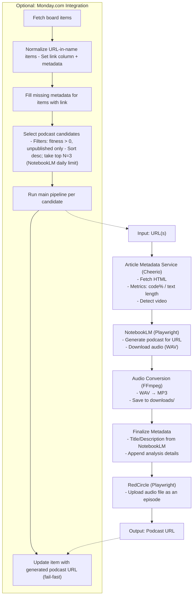

# Automated NotebookLM (Concept Prototype)

This repository demonstrates an experimental pipeline that automates Google NotebookLM to generate podcast audio from URLs, converts the audio to MP3, and optionally uploads an episode to RedCircle. It also includes an optional Monday.com integration to pick daily candidates.

Important: This project is a concept prototype intended for educational purposes. It automates interactions that may violate Google NotebookLM and RedCircle Terms of Use. Running this project is solely at your own risk and responsibility and should only be done after reviewing the relevant Terms of Use.

## Features

- Generate NotebookLM studio podcast for a given URL and download audio
- Convert WAV → MP3 using FFmpeg
- Upload MP3 to RedCircle as an episode (optional)
- Monday.com integration to prepare items and select top candidates (optional)

## Installation

1. Clone the repository:

```bash
git clone https://github.com/omril321/automated-notebooklm.git
cd automated-notebooklm
```

2. Install dependencies:

```bash
yarn install
```

3. Create a `.env` file with your Google credentials:

```bash
cp .env.example .env
```

4. Edit the `.env` file with your Google email and password:

```
GOOGLE_USER_EMAIL=your_email@gmail.com
GOOGLE_USER_PASSWORD=your_password

# Optional: RedCircle upload
RED_CIRCLE_USER=
RED_CIRCLE_PASSWORD=
PUBLISHED_PODCAST_NAME=

# Optional: Monday.com integration
MONDAY_API_TOKEN=
MONDAY_BOARD_URL=
MONDAY_EXCLUDED_GROUP_IDS=
```

## Contributing & Discussions

This project is shared as a concept/prototype, so I’m not accepting code contributions right now. That said, I’d love to hear your thoughts and learn from your use cases. If you want to chat, brainstorm, or ask questions:

- Open a GitHub Issue on this repo, or
- Reach out via direct message

Thanks for taking the time to check it out!

## Usage

### Generate podcasts (Monday.com mode by default)

```bash
yarn generate-podcasts
```

- By default, processes Monday board candidates (fitness > 0, unpublished only), sorts by fitness desc, and takes top 3 (NotebookLM daily limit). Fails fast on errors.

## Architecture



## Security Notes

- Your Google credentials are stored only in your local `.env` file
- The `.env` file is ignored by git and will not be committed
- Consider using an app password for better security if your account has 2FA enabled

## Requirements

- Node.js >= 24.4 and Yarn
- FFmpeg installed (with libmp3lame)
- Google account (automation may not work with 2FA)
- Chrome browser installed (Playwright uses Chrome channel)
- RedCircle account with an existing podcast (required for upload)

## Limitations

- UI brittleness: Selectors depend on current Google NotebookLM and RedCircle UIs and may break as sites change.
- Anti-automation measures: The browser setup includes anti-detection tweaks that may stop working and may violate Terms of Use.
- Long waits: NotebookLM podcast generation can take 10–12 minutes; flows use generous timeouts and fail fast on errors (no retries).
- Codec availability: FFmpeg must include libmp3lame; system-level codec differences can cause failures.
- Daily limits: NotebookLM appears to limit podcast generations; Monday integration selects top 3 candidates per run by design.
- Monday board size: The current query caps at 500 items and throws if exactly 500 are returned; pagination or filtered queries are required for larger boards.
- Network variability: Captchas, rate limits, or account protections may interrupt automation.
- Account risk: Do not run with primary accounts; review and comply with Google and RedCircle Terms of Use before any usage.

## License

ISC
